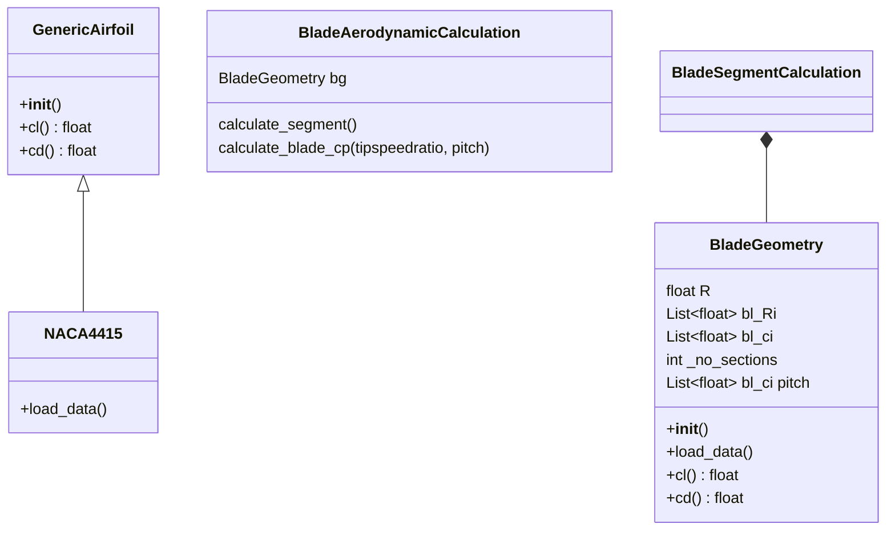

# NACA4415

```mermaid
classDiagram


    class GenericAirfoil{
        +__init__()
        +cl() float
        +cd() float 
        }

    class NACA4415{
        +load_data()
        }

    GenericAirfoil <|-- NACA4415

    class BladeGeometry{
        float R 
        List~float~ bl_Ri
        List~float~ bl_ci
        int _no_sections
        List~float~ bl_ci pitch
        +__init__()
        +load_data()
        +cl() float
        +cd() float 
        }


    class BladeAerodynamicCalculation{
        BladeGeometry bg
        calculate_segment()
        calculate_blade_cp(tipspeedratio, pitch)


    
        }

    BladeSegmentCalculation *-- BladeGeometry


```